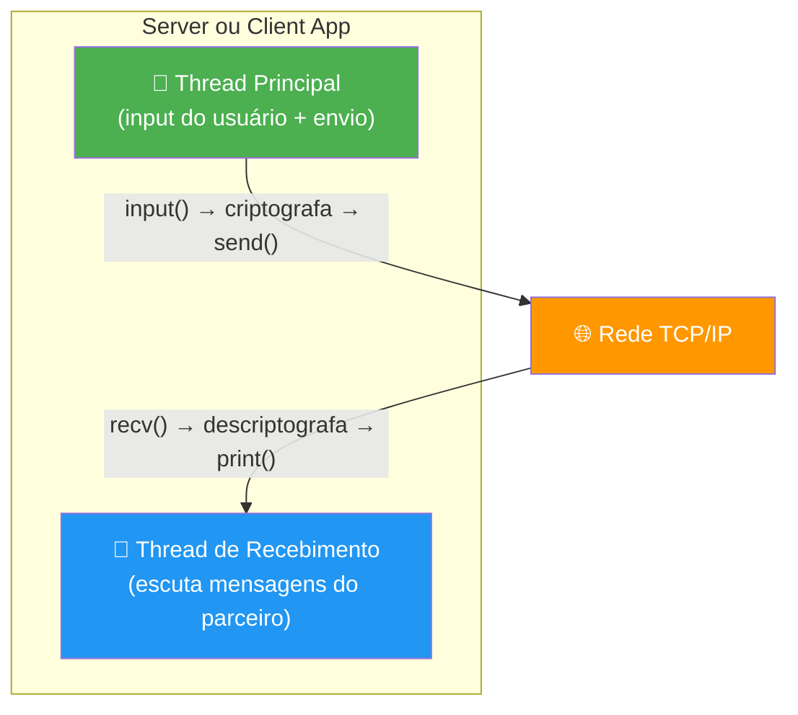
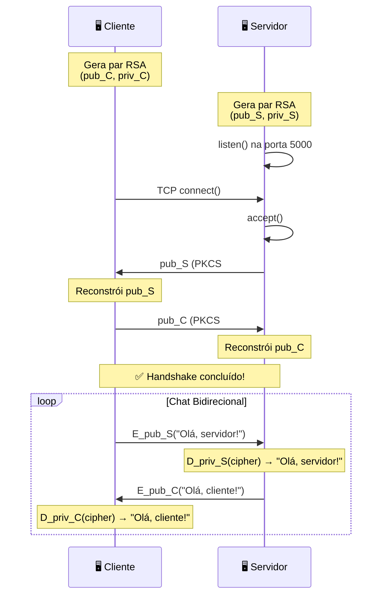

# 🔐 Sistema de Chat Criptografado com RSA — Explicação Detalhada

> **Objetivo:** Este documento explica, de forma didática e acessível, o funcionamento completo do sistema de chat com criptografia assimétrica RSA. Ao final da leitura, você compreenderá não apenas **o que** o sistema faz, mas também **como** e **por quê**.

---

## 📚 Sumário

1. [Conceitos Fundamentais de Criptografia](#1-conceitos-fundamentais-de-criptografia)
2. [O Algoritmo RSA em Detalhes](#2-o-algoritmo-rsa-em-detalhes)
3. [Arquitetura Geral do Sistema](#3-arquitetura-geral-do-sistema)
4. [Estrutura de Arquivos do Projeto](#4-estrutura-de-arquivos-do-projeto)
5. [Análise Detalhada do `crypto_utils.py`](#5-análise-detalhada-do-crypto_utilspy)
6. [Análise Detalhada do `server_app.py` e `client_app.py`](#6-análise-detalhada-do-server_apppy-e-client_apppy)
7. [O Protocolo de Comunicação](#7-o-protocolo-de-comunicação)
8. [Fluxo Completo de uma Conversa](#8-fluxo-completo-de-uma-conversa)
9. [Como Executar o Sistema](#9-como-executar-o-sistema)
10. [Demonstração Visual do Funcionamento](#10-demonstração-visual-do-funcionamento)
11. [Limitações e Considerações](#11-limitações-e-considerações)

---

## 1. Conceitos Fundamentais de Criptografia

### 1.1 O que é Criptografia?

Criptografia é a ciência de transformar informações legíveis (texto plano) em um formato ilegível (texto cifrado), de modo que apenas pessoas autorizadas possam reverter o processo. Pense nela como um **cadeado digital**: você tranca uma mensagem com uma chave, e somente quem possui a chave correta pode abri-la.

```
┌─────────────────┐      Chave de       ┌─────────────────┐
│  "Olá, mundo!"  │ ──── Criptografia ──▶│ "xK9#mZ2!aQ..."  │
│  (Texto Plano)  │                      │  (Texto Cifrado) │
└─────────────────┘                      └─────────────────┘
                                                 │
                                        Chave de Descriptografia
                                                 │
                                                 ▼
                                        ┌─────────────────┐
                                        │  "Olá, mundo!"  │
                                        │  (Texto Plano)  │
                                        └─────────────────┘
```

### 1.2 Criptografia Simétrica vs. Assimétrica

Existem dois grandes paradigmas na criptografia moderna:

| Característica | Simétrica (ex: AES) | Assimétrica (ex: RSA) |
|---|---|---|
| **Número de chaves** | 1 chave (compartilhada) | 2 chaves (pública + privada) |
| **Quem encripta?** | Quem tem a chave secreta | Qualquer um (usa a chave **pública** do destinatário) |
| **Quem decripta?** | Quem tem a mesma chave secreta | Apenas o dono da chave **privada** |
| **Analogia** | Um cofre com uma única chave que ambos possuem | Uma caixa de correio: todos podem depositar (chave pública), mas só o dono abre (chave privada) |
| **Velocidade** | Muito rápida | Mais lenta |
| **Problema principal** | Como compartilhar a chave secreta com segurança? | Mais pesada computacionalmente |

> **Nosso sistema usa RSA (assimétrico)**, que resolve exatamente o problema de "como trocar chaves com segurança". Como a chave pública não é segredo, podemos enviá-la abertamente pela rede!

### 1.3 Analogia do Cofre e do Cadeado

Imagine a seguinte situação:

1. **Alice** quer receber mensagens secretas de **Bob**.
2. Alice compra um **cadeado especial** que tem duas chaves: uma chave para **fechar** (chave pública) e outra para **abrir** (chave privada).
3. Alice envia o **cadeado aberto** (chave pública) para Bob pelos Correios. Não importa se alguém interceptar — o cadeado só serve para fechar!
4. Bob coloca sua mensagem em um cofre, fecha com o cadeado de Alice e envia o cofre.
5. Somente Alice, com sua **chave privada**, pode abrir o cadeado e ler a mensagem.

> 🔑 **Ponto crucial:** Ninguém — nem mesmo Bob — consegue abrir o cofre depois de fechado. Somente a chave privada de Alice pode fazer isso.

---

## 2. O Algoritmo RSA em Detalhes

### 2.1 Origem do Nome

RSA é a sigla dos sobrenomes de seus criadores: **R**ivest, **S**hamir e **A**dleman, que publicaram o algoritmo em 1977 no MIT. É um dos algoritmos de criptografia assimétrica mais utilizados no mundo até hoje.

### 2.2 Como o RSA Funciona (Matematicamente)

O RSA se baseia na **dificuldade de fatorar números primos grandes**. Vamos entender o passo a passo:

#### Geração das Chaves

```
1. Escolhem-se dois números primos enormes: P e Q
   Exemplo simples (na prática, usa-se números gigantes):
   P = 61, Q = 53

2. Calcula-se N = P × Q
   N = 61 × 53 = 3233
   → N será parte de ambas as chaves (pública e privada)

3. Calcula-se φ(N) = (P-1) × (Q-1)
   φ = 60 × 52 = 3120

4. Escolhe-se um número E tal que:
   - 1 < E < φ(N)
   - E e φ(N) sejam coprimos (máximo divisor comum = 1)
   E = 17 (escolha comum)

5. Calcula-se D tal que: (E × D) mod φ(N) = 1
   D = 2753

Resultado:
   Chave Pública:  (E, N) = (17, 3233)
   Chave Privada:  (D, N) = (2753, 3233)
```

#### Criptografia de uma Mensagem

```
Para criptografar um número M (mensagem) com a chave pública (E, N):

   Cifra = M^E mod N

Exemplo: M = 65
   Cifra = 65^17 mod 3233 = 2790
```

#### Descriptografia

```
Para descriptografar a cifra C com a chave privada (D, N):

   Mensagem = C^D mod N

Exemplo: C = 2790
   Mensagem = 2790^2753 mod 3233 = 65 ✓
```

### 2.3 Por que o RSA é Seguro?

A segurança do RSA está no fato de que, conhecendo apenas `N` e `E` (chave pública), é **computacionalmente inviável** descobrir `D` (chave privada). Para calcular `D`, seria necessário fatorar `N` em seus primos originais `P` e `Q`.

- Para números pequenos como `N = 3233`, fatorar é trivial.
- Para números de **1024 bits** (~309 dígitos decimais), fatorar levaria **milhares de anos** mesmo com supercomputadores.
- Para números de **2048 bits**, seria necessário mais tempo do que a idade do universo!

> Nosso sistema usa chaves de **1024 bits**, que oferecem segurança adequada para fins acadêmicos.

### 2.4 O Problema do Tamanho da Mensagem

O RSA tem uma limitação importante: **só pode criptografar mensagens menores que o tamanho da chave**.

Para chaves de 1024 bits com padding PKCS#1, o limite é de aproximadamente **117 bytes** por operação. Isso significa que não podemos criptografar uma mensagem longa de uma só vez.

**Nossa solução: Chunking (fragmentação)**

```
Mensagem original: "Olá, como vai você? Tudo bem?" (30 bytes)

┌─────────────────────────────────────────────────────┐
│ "Olá, como vai você? Tudo bem?"                     │
└─────────────────────────────────────────────────────┘
                      │
                      ▼ Divisão em chunks de 100 bytes
┌──────────────────┐ ┌──────────────────┐
│ "Olá, como vai..." │ │ "...Tudo bem?"    │
│    (100 bytes)     │ │   (30 bytes)      │
└──────────────────┘ └──────────────────┘
          │                    │
          ▼                    ▼ Criptografia individual
┌──────────────────┐ ┌──────────────────┐
│  Ciphertext 1    │ │  Ciphertext 2    │
│   (128 bytes)    │ │   (128 bytes)    │
└──────────────────┘ └──────────────────┘
          │                    │
          └────────┬───────────┘
                   ▼ Montagem do payload
┌────────────────────────────────────────────────────┐
│ [2 bytes: 128] [Ciphertext 1] [2 bytes: 128] [Ciphertext 2] │
└────────────────────────────────────────────────────┘
```

---

## 3. Arquitetura Geral do Sistema

### 3.1 Visão Macro

O sistema consiste em **duas aplicações independentes** que se comunicam via rede TCP/IP:

```
┌─────────────────────────┐          ┌─────────────────────────┐
│     SERVER_APP.PY       │          │     CLIENT_APP.PY        │
│                         │          │                         │
│  1. Gera par RSA        │          │  1. Gera par RSA        │
│  2. Aguarda conexão     │  TCP/IP  │  2. Conecta ao servidor │
│  3. Troca chave pública │◄────────▶│  3. Troca chave pública │
│  4. Chat criptografado  │          │  4. Chat criptografado  │
│                         │          │                         │
│  Thread 1: envia msg    │          │  Thread 1: envia msg    │
│  Thread 2: recebe msg   │          │  Thread 2: recebe msg   │
└─────────────────────────┘          └─────────────────────────┘
```

### 3.2 Modelo de Threads

Cada aplicação roda **duas threads simultâneas**:



Sem esse modelo de threads, o chat não seria "em tempo real" — o usuário teria que esperar receber uma mensagem antes de poder enviar a sua, e vice-versa.

---

## 4. Estrutura de Arquivos do Projeto

```
atividade tuneeling/
├── crypto_utils.py      ← Módulo de criptografia (RSA + chunking)
├── server_app.py        ← Aplicação servidora
├── client_app.py        ← Aplicação cliente
└── planejamento.txt     ← Plano de desenvolvimento original
```

| Arquivo | Responsabilidade |
|---|---|
| `crypto_utils.py` | Toda a lógica criptográfica: geração de chaves, serialização, criptografia/descriptografia com chunking |
| `server_app.py` | Abre porta TCP, aguarda conexão, realiza handshake e gerencia o chat |
| `client_app.py` | Conecta ao servidor, realiza handshake e gerencia o chat |

---

## 5. Análise Detalhada do `crypto_utils.py`

Este é o coração criptográfico do sistema. Vamos analisar cada função.

### 5.1 Constantes do Módulo

```python
import rsa

TAMANHO_CHAVE = 1024       # Tamanho da chave RSA em bits
TAMANHO_CHUNK = 100        # Máximo de bytes por chunk (limite seguro)
```

- **`TAMANHO_CHAVE = 1024`**: Define que as chaves RSA terão 1024 bits. Isso gera um módulo `N` de aproximadamente 309 dígitos decimais. O valor 1024 foi escolhido por equilibrar segurança e desempenho para este trabalho acadêmico.

- **`TAMANHO_CHUNK = 100`**: Como o RSA com chave de 1024 bits e padding PKCS#1 suporta no máximo 117 bytes por operação, usamos o valor conservador de 100 bytes por chunk. Isso garante que **nunca** ultrapassaremos o limite, mesmo com o overhead do padding.

### 5.2 `gerar_chaves(tamanho_bits: int = 1024) -> tuple`

```python
def gerar_chaves(tamanho_bits: int = TAMANHO_CHAVE) -> tuple:
    chave_publica, chave_privada = rsa.newkeys(tamanho_bits)
    return chave_publica, chave_privada
```

**O que acontece aqui:**

1. A função `rsa.newkeys(1024)` da biblioteca `rsa` gera um par de chaves completo.
2. Internamente, a biblioteca:
   - Gera dois números primos aleatórios `P` e `Q` de ~512 bits cada
   - Calcula `N = P × Q` (o módulo, ~1024 bits)
   - Calcula `φ(N) = (P-1)(Q-1)`
   - Escolhe `E = 65537` (valor padrão eficiente)
   - Calcula `D = E⁻¹ mod φ(N)`
3. Retorna uma tupla `(PublicKey, PrivateKey)`.

> ⏱️ Esta operação é a mais demorada do sistema (pode levar 1-3 segundos), pois encontrar primos grandes é computacionalmente custoso.

### 5.3 `serializar_chave_publica(chave_publica) -> bytes`

```python
def serializar_chave_publica(chave_publica: rsa.PublicKey) -> bytes:
    return chave_publica.save_pkcs1()
```

**O que é PKCS#1?**

PKCS (Public-Key Cryptography Standards) #1 é um formato padrão da indústria para representar chaves RSA. A chave pública RSA consiste em dois números: `n` (módulo) e `e` (expoente público). O formato PKCS#1 codifica esses números como uma sequência de bytes estruturada usando ASN.1 (Abstract Syntax Notation One).

```
Estrutura PKCS#1 para chave pública:

┌────────────┬──────────────┬──────────────┐
│  Cabeçalho │  Módulo (n)  │ Expoente (e) │
│  (metadados)│ (~128 bytes) │  (~3 bytes)  │
└────────────┴──────────────┴──────────────┘
```

**Por que precisamos serializar?** Os sockets TCP/IP só transmitem bytes. Precisamos converter o objeto Python `PublicKey` em uma sequência de bytes que possa viajar pela rede e ser reconstruída do outro lado.

### 5.4 `desserializar_chave_publica(dados: bytes) -> PublicKey`

```python
def desserializar_chave_publica(dados: bytes) -> rsa.PublicKey:
    return rsa.PublicKey.load_pkcs1(dados)
```

Faz o processo inverso: recebe bytes no formato PKCS#1 e reconstrói o objeto `PublicKey` na memória, pronto para ser usado em operações de criptografia.

### 5.5 `criptografar_mensagem(mensagem: str, chave_publica) -> bytes`

```python
def criptografar_mensagem(mensagem: str, chave_publica: rsa.PublicKey) -> bytes:
    dados = mensagem.encode('utf-8')
    resultado = bytearray()

    for i in range(0, len(dados), TAMANHO_CHUNK):
        chunk = dados[i:i + TAMANHO_CHUNK]
        chunk_criptografado = rsa.encrypt(chunk, chave_publica)
        tamanho = len(chunk_criptografado)
        resultado.extend(tamanho.to_bytes(2, byteorder='big'))
        resultado.extend(chunk_criptografado)

    return bytes(resultado)
```

**Fluxo detalhado:**

```
Passo 1: Converte a string para bytes UTF-8
         "Olá" → b'Ol\xc3\xa1' (5 bytes)

Passo 2: Divide em chunks de no máximo 100 bytes
         (para mensagens curtas, apenas 1 chunk)

Passo 3: Para cada chunk:
         a) Criptografa com a chave pública do destinatário
            rsa.encrypt(chunk, chave_publica)
            → produz ~128 bytes de ciphertext por chunk
         
         b) Prefixa com 2 bytes indicando o tamanho do ciphertext
            tamanho.to_bytes(2, byteorder='big')
            → Esses 2 bytes são ESSENCIAIS para o receptor saber
              onde cada chunk começa e termina!

Passo 4: Concatena tudo em um único array de bytes
```

**Formato do payload criptografado:**

```
┌────────────┬──────────────────────┬────────────┬──────────────────────┐
│ 2 bytes    │ Ciphertext Chunk 1   │ 2 bytes    │ Ciphertext Chunk 2   │
│ (tamanho)  │   (~128 bytes)       │ (tamanho)  │   (~128 bytes)       │
└────────────┴──────────────────────┴────────────┴──────────────────────┘
     ↑                                  ↑
     └── Big-endian, indica quantos     └── Permite que o receptor leia
         bytes tem o chunk seguinte         exatamente o chunk correto
```

> 🎯 **Por que 2 bytes para o tamanho?** Um chunk criptografado com RSA-1024 tem sempre 128 bytes (1024 bits ÷ 8). 2 bytes (máx. 65535) são mais que suficientes para armazenar o valor 128.

### 5.6 `descriptografar_mensagem(dados_criptografados: bytes, chave_privada) -> str`

```python
def descriptografar_mensagem(dados_criptografados: bytes, chave_privada: rsa.PrivateKey) -> str:
    resultado = bytearray()
    pos = 0

    while pos < len(dados_criptografados):
        tamanho_chunk = int.from_bytes(dados_criptografados[pos:pos + 2], byteorder='big')
        pos += 2

        chunk_criptografado = dados_criptografados[pos:pos + tamanho_chunk]
        pos += tamanho_chunk

        chunk = rsa.decrypt(chunk_criptografado, chave_privada)
        resultado.extend(chunk)

    return bytes(resultado).decode('utf-8')
```

**Fluxo detalhado:**

```
Passo 1: Inicia um cursor 'pos' na posição 0 do array de bytes

Passo 2: Enquanto houver dados (pos < tamanho_total):
         a) Lê 2 bytes → descobre o tamanho do próximo chunk
         b) Avança o cursor em 2 bytes
         c) Lê exatamente 'tamanho_chunk' bytes → ciphertext do chunk
         d) Descriptografa com a chave PRIVADA
            rsa.decrypt(chunk_criptografado, chave_privada)
         e) Adiciona o resultado ao buffer
         f) Continua o loop

Passo 3: Converte o buffer completo de bytes para string UTF-8
```

**Por que usamos a chave privada para descriptografar?**

Esta é a **propriedade fundamental do RSA**:
- Algo criptografado com a **chave pública** só pode ser descriptografado com a **chave privada** correspondente.
- É matematicamente impossível descriptografar usando a mesma chave pública.
- A chave privada nunca sai do computador que a gerou — por isso o sistema é seguro!

---

## 6. Análise Detalhada do `server_app.py` e `client_app.py`

### 6.1 Funções Auxiliares de Rede

Ambas as aplicações compartilham funções idênticas para comunicação via socket:

#### `enviar_dados(sock, dados)`

```python
def enviar_dados(sock: socket.socket, dados: bytes) -> None:
    tamanho = len(dados)
    sock.sendall(tamanho.to_bytes(4, byteorder='big'))
    sock.sendall(dados)
```

**Por que prefixar com 4 bytes de tamanho?**

O protocolo TCP é um **fluxo contínuo de bytes** (stream). Ele não tem noção de "mensagens" — se você enviar 100 bytes e depois 200 bytes, o receptor pode receber tudo junto (300 bytes) ou em pedaços separados.

```
Sem prefixo de tamanho:
  Emissor:  send("Olá")    send("Mundo")
  Receptor: recv() → "OláMundo"  ← Onde começa uma mensagem e termina a outra?

Com prefixo de tamanho:
  Emissor:  [0,0,0,3] "Olá"    [0,0,0,5] "Mundo"
  Receptor: Lê 4 bytes → "3" → Lê 3 bytes → "Olá"
            Lê 4 bytes → "5" → Lê 5 bytes → "Mundo"  ✓
```

O formato usa **4 bytes em big-endian** (uint32), suportando mensagens de até ~4 GB — mais que suficiente!

#### `receber_dados(sock)`

```python
def receber_dados(sock: socket.socket) -> bytes:
    header = sock.recv(4)
    if not header:
        return b''
    tamanho = int.from_bytes(header, byteorder='big')

    dados = bytearray()
    while len(dados) < tamanho:
        restante = tamanho - len(dados)
        parte = sock.recv(min(restante, 4096))
        if not parte:
            break
        dados.extend(parte)
    return bytes(dados)
```

**Por que o loop `while`?**

O `sock.recv(n)` **não garante** que receberemos exatamente `n` bytes. Em redes congestionadas, podemos receber apenas parte dos dados. O loop garante que continuamos lendo até receber **todos** os bytes esperados.

```
Exemplo: esperamos 1000 bytes

recv(1000) → 400 bytes (só chegou isso por enquanto)
recv(600)  → 350 bytes
recv(250)  → 250 bytes
Total: 1000 bytes ✓
```

### 6.2 A Thread de Recebimento

```python
def thread_receber(sock: socket.socket, chave_privada) -> None:
    while True:
        try:
            dados_cripto = receber_dados(sock)
            if not dados_cripto:
                print("\n[!] Conexão encerrada pelo parceiro.")
                break

            print(f"\n[DEBUG] Mensagem cifrada recebida ({len(dados_cripto)} bytes): "
                  f"{dados_cripto[:40].hex()}...")

            mensagem = descriptografar_mensagem(dados_cripto, chave_privada)
            print(f"\n[Parceiro]: {mensagem}\n[Você]: ", end='', flush=True)

        except (ConnectionError, OSError) as e:
            print(f"\n[!] Erro de conexão: {e}")
            break
        except Exception as e:
            print(f"\n[!] Erro ao processar mensagem: {e}")
            break

    sys.exit(0)
```

**Destaques importantes:**

1. **Loop infinito**: A thread fica permanentemente ouvindo novas mensagens.
2. **`if not dados_cripto`**: Se `receber_dados` retornar bytes vazios, significa que a conexão foi fechada pelo outro lado.
3. **Linha `[DEBUG]`**: Exibe os primeiros 40 bytes do ciphertext em hexadecimal. Isso é puramente para demonstração acadêmica — prova que os dados estão realmente cifrados durante o trânsito!
4. **`descriptografar_mensagem(dados_cripto, chave_privada)`**: Usa a **própria chave privada** para decifrar. Esta é a essência do RSA.
5. **`end='', flush=True`**: Truque de UX para que o prompt `[Você]:` apareça logo após a mensagem recebida.

### 6.3 A Função `main()` — Servidor

O servidor segue esta sequência:

```
┌─────────────────────────────────────────────────────────────┐
│  1. Gerar par de chaves RSA                                 │
│  2. Criar socket, bind na porta 5000, listen()              │
│  3. accept() — aguardar conexão do cliente                  │
│  4. Enviar chave pública para o cliente                     │
│  5. Receber chave pública do cliente                        │
│  6. Iniciar thread de recebimento                           │
│  7. Loop principal: input() → criptografar → enviar         │
└─────────────────────────────────────────────────────────────┘
```

### 6.4 A Função `main()` — Cliente

O cliente é quase idêntico, mas com a ordem do handshake invertida:

```
┌─────────────────────────────────────────────────────────────┐
│  1. Gerar par de chaves RSA                                 │
│  2. Criar socket, connect() ao servidor                     │
│  3. Receber chave pública do servidor (PRIMEIRO!)           │
│  4. Enviar chave pública para o servidor                    │
│  5. Iniciar thread de recebimento                           │
│  6. Loop principal: input() → criptografar → enviar         │
└─────────────────────────────────────────────────────────────┘
```

> ⚠️ **A ordem importa!** O servidor envia sua chave primeiro, e o cliente espera recebê-la antes de enviar a sua. Se a ordem fosse trocada, ocorreria um deadlock: ambos esperando receber sem ninguém enviar.

### 6.5 Criptografia no Envio

No loop principal de ambas as aplicações:

```python
mensagem = input('[Você]: ')

# Criptografa com a chave pública DO PARCEIRO
dados_cripto = criptografar_mensagem(mensagem, chave_publica_parceiro)

# Exibe o ciphertext para demonstração
print(f"[DEBUG] Mensagem cifrada enviada ({len(dados_cripto)} bytes): "
      f"{dados_cripto[:40].hex()}...")

# Envia pela rede
enviar_dados(sock, dados_cripto)
```

**Ponto crítico de segurança:** Note que usamos `chave_publica_parceiro` para criptografar. Isso garante que:
- Qualquer um pode criptografar (a chave é pública!)
- Somente o parceiro, com sua chave privada, pode descriptografar

---

## 7. O Protocolo de Comunicação

### 7.1 Camada de Transporte

```
┌──────────────────────────────────────────────────┐
│               Camada de Aplicação                │
│  Texto do chat, comandos (/sair)                 │
├──────────────────────────────────────────────────┤
│            Camada de Criptografia                │
│  RSA com chunking (crypto_utils.py)              │
├──────────────────────────────────────────────────┤
│           Camada de Enquadramento                │
│  Prefixo de 4 bytes com tamanho da mensagem      │
├──────────────────────────────────────────────────┤
│              Camada de Transporte                │
│  TCP/IP (socket — 127.0.0.1:5000)               │
└──────────────────────────────────────────────────┘
```

### 7.2 Sequência do Handshake



### 7.3 Estrutura das Mensagens na Rede

```
Mensagem de Handshake (chave pública):

┌────────────┬──────────────────────────────────┐
│ 4 bytes    │ Chave Pública em PKCS#1          │
│ (tamanho)  │       (~160 bytes)               │
└────────────┴──────────────────────────────────┘

Mensagem de Chat (texto criptografado):

┌────────────┬──────────────────────────────────────────────────┐
│ 4 bytes    │ Payload Criptografado (formato chunking)         │
│ (tamanho)  │ ┌──────────┬─────────────┬──────────┬─────────┐ │
│            │ │ 2 bytes  │ Ciphertext  │ 2 bytes  │ Ciph... │ │
│            │ │ (tam C1) │   Chunk 1   │ (tam C2) │ Chunk 2 │ │
│            │ └──────────┴─────────────┴──────────┴─────────┘ │
└────────────┴──────────────────────────────────────────────────┘
```

---

## 8. Fluxo Completo de uma Conversa

Vamos simular uma conversa entre **Alice** (servidora) e **Bob** (cliente):

### Passo 1: Inicialização

```
Alice (Servidor):
  [*] Gerando par de chaves RSA (1024 bits)...
  [✓] Chaves geradas com sucesso!
  [*] Aguardando conexão em 127.0.0.1:5000...

Bob (Cliente):
  [*] Gerando par de chaves RSA (1024 bits)...
  [✓] Chaves geradas com sucesso!
  [*] Conectando ao servidor 127.0.0.1:5000...
  [✓] Conectado ao servidor!
```

### Passo 2: Handshake

```
Alice:
  [→] Chave pública enviada ao cliente.

Bob:
  [←] Chave pública do servidor recebida.  ← Chegou a chave de Alice
  [→] Chave pública enviada ao servidor.    ← Bob envia a dele

Alice:
  [←] Chave pública do cliente recebida.   ← Chegou a chave de Bob
  [✓] Handshake concluído.
```

### Passo 3: Troca de Mensagens

```
Bob digita: "Oi Alice, tudo bem?"

O que acontece no código do Bob:
  1. mensagem = "Oi Alice, tudo bem?"
  2. dados = b'Oi Alice, tudo bem?'  (22 bytes)
  3. Chunk único (22 < 100 bytes):
     chunk_criptografado = rsa.encrypt(dados, pub_Alice)
     → 128 bytes de ciphertext
  4. Payload = [0, 128] + [128 bytes de ciphertext]
  5. Envia: [0,0,0,132] + [payload de 132 bytes]  (4 + 132 = 136 bytes na rede)

Bob vê no console:
  [DEBUG] Mensagem cifrada enviada (132 bytes): a3f2b81c9d4e...
  
Alice recebe:
  [DEBUG] Mensagem cifrada recebida (132 bytes): a3f2b81c9d4e...
  [Parceiro]: Oi Alice, tudo bem?

Alice digita: "Tudo ótimo, Bob! Como vai você?"

O que acontece no código da Alice:
  1. mensagem = "Tudo ótimo, Bob! Como vai você?"
  2. Criptografa com pub_Bob
  3. Envia 136 bytes pela rede

Bob vê no console:
  [DEBUG] Mensagem cifrada recebida (132 bytes): 7e1a59f03c2b...
  [Parceiro]: Tudo ótimo, Bob! Como vai você?
```

### Passo 4: Encerramento

```
Bob digita: "/sair"
  → Conexão fechada
  → Alice detecta: dados_cripto vazio → encerra
```

---

## 9. Como Executar o Sistema

### 9.1 Pré-requisitos

- Python 3.7 ou superior instalado
- Biblioteca `rsa` (instalação única)

### 9.2 Instalação

```bash
pip install rsa
```

### 9.3 Execução

**Importante:** Execute o servidor primeiro, depois o cliente. Use dois terminais separados.

**Terminal 1 — Servidor:**
```bash
python server_app.py
```

**Terminal 2 — Cliente:**
```bash
python client_app.py
```

### 9.4 Comandos do Chat

| Comando | Ação |
|---|---|
| Qualquer texto | Envia mensagem criptografada para o parceiro |
| `/sair` | Encerra a conversa e fecha a conexão |
| `Ctrl+C` | Interrompe a aplicação imediatamente |

---

## 10. Demonstração Visual do Funcionamento

### 10.1 O que Trafega na Rede (Exemplo Real)

Quando Bob envia "Oi", isto é o que realmente passa pelo cabo de rede:

```
Sem criptografia (simulação hipotética):
  00 00 00 02 4F 69
  └─tamanho─┘ └Oi ┘

Com criptografia (sistema real):
  00 00 00 84 00 80 A3 F2 1B 8C 9D 4E 7F 3A 51 C2
  └─tamanho─┘ └─tam chunk─┘ └── ciphertext (128 bytes) ── ... ──┘
  (132 bytes)  (2 bytes)
```

Como se pode ver, alguém interceptando o tráfego de rede veria apenas bytes aparentemente aleatórios — **totalmente ininteligíveis** sem a chave privada!

### 10.2 O Debug no Console

As linhas `[DEBUG]` no console são uma janela para o que acontece nos bastidores:

```
[DEBUG] Mensagem cifrada enviada (132 bytes): a3f2b81c9d4e7f3a51c26b8d0e1f2a3b4c5d6e7f...
                                         └─── 40 bytes em hexadecimal ───┘
```

Isso comprova que:
1. A mensagem **não** viajou em texto plano
2. O ciphertext tem tamanho fixo (múltiplo de 128 + 2 bytes de cabeçalho por chunk)
3. O mesmo texto plano gera ciphertexts diferentes a cada envio (devido ao padding aleatório do PKCS#1)

---

## 11. Limitações e Considerações

### 11.1 Limitações do Sistema Atual

| Limitação | Explicação |
|---|---|
| **Apenas 2 participantes** | O sistema suporta somente chat 1-a-1 (um servidor, um cliente) |
| **Sem autenticação** | Não há verificação de identidade — confia-se que a chave pública recebida é legítima |
| **RSA puro para chat** | Na prática, usa-se RSA para trocar uma chave AES (simétrica), e AES para o chat |
| **Sem Perfect Forward Secrecy** | Se a chave privada for comprometida no futuro, todas as mensagens passadas podem ser descriptografadas |
| **Chaves em memória** | As chaves são geradas e mantidas apenas em RAM — reiniciar a aplicação gera novas chaves |

### 11.2 O Que Poderia Ser Melhorado

1. **Troca de chaves com Diffie-Hellman Efêmero (ECDHE)**: Forneceria Perfect Forward Secrecy
2. **Certificados digitais**: Autenticariam as chaves públicas (como no HTTPS)
3. **Criptografia híbrida**: RSA para trocar chave AES + AES para o chat (muito mais rápido)
4. **Assinatura digital das mensagens**: Garantiria integridade e não-repúdio
5. **Interface gráfica**: Tkinter ou PyQt para melhor experiência do usuário

### 11.3 Por que Este Sistema é Adequado para Fins Acadêmicos?

Apesar das limitações, este sistema demonstra perfeitamente os conceitos fundamentais:

- ✅ Geração de pares de chaves assimétricas
- ✅ Troca segura de chaves públicas (handshake)
- ✅ Criptografia com chave pública do destinatário
- ✅ Descriptografia com chave privada própria
- ✅ Chunking para mensagens maiores que o limite do RSA
- ✅ Serialização/desserialização de chaves
- ✅ Comunicação bidirecional em tempo real com threads
- ✅ Protocolo de enquadramento de mensagens sobre TCP

---

## 📖 Glossário de Termos Criptográficos

| Termo | Definição |
|---|---|
| **Texto Plano (Plaintext)** | Dados originais, legíveis, antes da criptografia |
| **Texto Cifrado (Ciphertext)** | Dados após a criptografia — ilegíveis sem a chave |
| **Chave Pública** | Chave que pode ser compartilhada livremente; usada para **criptografar** |
| **Chave Privada** | Chave mantida em segredo; usada para **descriptografar** |
| **Handshake** | Processo inicial de troca de informações (aqui, troca de chaves públicas) |
| **PKCS#1** | Padrão de formatação para chaves RSA (Public-Key Cryptography Standards #1) |
| **Big-Endian** | Formato de ordenação de bytes onde o byte mais significativo vem primeiro |
| **Padding** | Bytes extras adicionados à mensagem antes da criptografia (reforça a segurança) |
| **Chunking** | Técnica de dividir dados em pedaços menores para processamento |
| **Socket** | Ponto final de uma conexão de rede; abstração para comunicação TCP/IP |
| **Thread** | Linha de execução independente dentro de um processo (paralelismo) |

---

## 🎯 Resumo Final

Este sistema implementa um **chat ponto-a-ponto com criptografia ponta-a-ponta usando RSA de 1024 bits**. Ele demonstra na prática como a criptografia assimétrica permite que duas partes se comuniquem com segurança mesmo que todo o tráfego de rede seja interceptado — desde que as chaves privadas permaneçam secretas.

A arquitetura é simétrica pós-handshake (ambos os lados têm capacidades idênticas), usa **threading** para comunicação bidirecional simultânea e implementa **chunking** para superar a limitação de tamanho do RSA. As mensagens `[DEBUG]` no console fornecem transparência sobre o processo de cifragem, permitindo verificar que os dados trafegam realmente criptografados.

> 🔐 **Princípio fundamental demonstrado:** "O que é trancado com a chave pública só pode ser destrancado com a chave privada correspondente."

---

*Documento criado para fins educacionais — Disciplina de Criptografia e Segurança de Sistemas Computacionais.*
