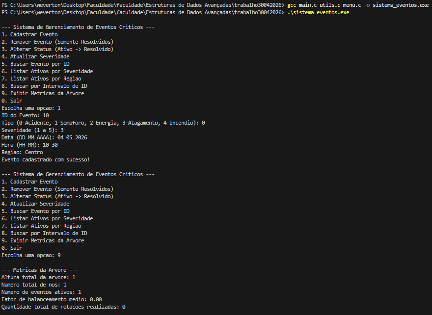
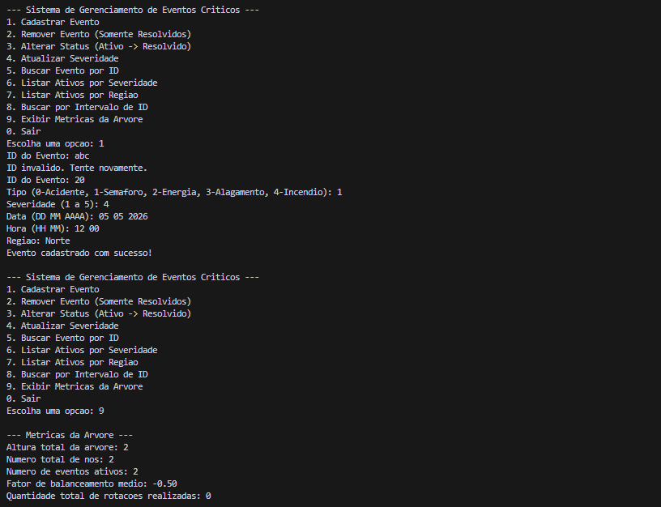
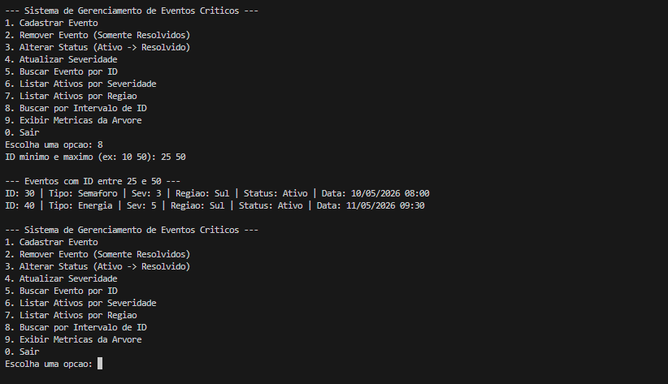
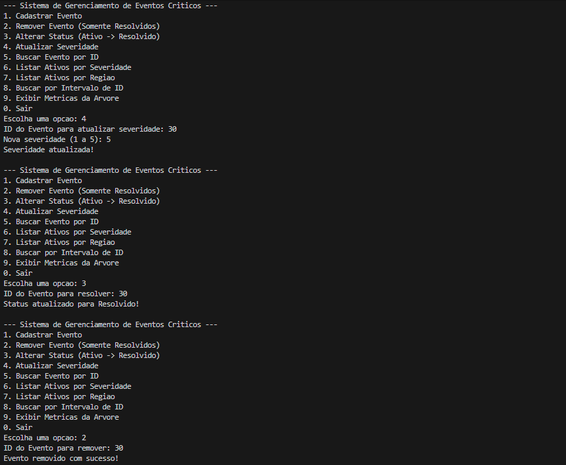

# Sistema de Gerenciamento de Eventos Críticos

## Descrição Geral do Sistema
Este sistema foi desenvolvido na linguagem C para monitorar e gerenciar, em tempo real, eventos críticos urbanos em uma cidade inteligente, tais como acidentes de trânsito, falhas em semáforos, interrupções de energia, alagamentos e incêndios.

O núcleo do sistema utiliza uma **Árvore AVL (Adelson-Velsky e Landis)**, que é uma árvore binária de busca autobalanceada. Essa estrutura garante que operações essenciais — como inserção, remoção e busca por ID de eventos — sejam executadas de maneira eficiente com complexidade **O(log N)** no pior caso. O balanceamento contínuo da árvore impede que ela degenere em uma lista encadeada, garantindo resposta rápida mesmo com um grande volume de dados.

### Principais Funcionalidades:
- **Gerenciamento da Árvore AVL:** Cadastro, remoção (apenas para eventos resolvidos), balanceamento através de rotações simples e duplas, e busca eficiente de eventos.
- **Consultas Avançadas:** Listagem de eventos por intervalo de severidade, relatório por região (ordenado via percurso em-ordem) e busca por intervalo de IDs.
- **Atualizações:** Possibilidade de modificar o status de um evento (de Ativo para Resolvido) e atualizar sua severidade sem quebrar a consistência da árvore.
- **Métricas:** Cálculo da altura da árvore, número de nós e eventos ativos, fator de balanceamento médio e total de rotações realizadas desde a execução.

## Instruções de Compilação e Execução

### Pré-requisitos
- Um compilador C (como GCC) instalado no sistema.

### Como Compilar
Abra um terminal no diretório onde os arquivos fonte (`main.c`, `utils.c`, `utils.h`, `menu.c`, `menu.h`) estão localizados e execute o seguinte comando:

```bash
gcc main.c utils.c menu.c -o sistema_eventos
```

### Como Executar
Após a compilação com sucesso, inicie o sistema executando:

- **No Windows:**
  ```cmd
  .\sistema_eventos.exe
  ```

- **No Linux ou macOS:**
  ```bash
  ./sistema_eventos
  ```

## Relatório Técnico
As funcionalidades foram completamente implementadas utilizando alocação dinâmica de memória, `struct`, `enum` e ponteiros. A estrutura foi construída inteiramente do zero, atendendo às restrições de não usar bibliotecas prontas de árvores ou vetores/listas como substitutos. 

O algoritmo de inserção e remoção mantém restritamente o critério de balanceamento, onde a diferença de altura entre as subárvores esquerda e direita de cada nó (fator de balanceamento) nunca excede em módulo de 1, efetuando as rotações necessárias. O sistema também possui validações interativas para garantir a inserção correta de dados no menu de navegação contínua.


### Teste 1: Cadastro Correto e Métricas Iniciais
Neste teste é demonstrada a capacidade de compilar o sistema, inserir um evento válido e checar se as métricas iniciais da árvore AVL (altura, número de nós, fator de balanceamento, etc) estão sendo atualizadas corretamente.



---

### Teste 2: Tratamento de Erros de Input e Novo Cadastro
Esse teste comprova que o sistema possui validação de entrada e recusa letras no lugar de números, não quebrando a execução e permitindo a continuidade do fluxo.



---

### Teste 3: Consultas Avançadas
Neste teste é demonstrada a capacidade do sistema realizar consultas por intervalo de severidade, listar eventos ativos filtrados por região e listar por um intervalo numérico de IDs.



---

### Teste 4: Operações de Atualização e Remoção
Este teste comprova a robustez das operações em árvores AVL: alterar a severidade, modificar o status de Ativo para Resolvido e remover o nó com segurança (o qual estava proibido quando ativo, mas é liberado ao ser resolvido).



