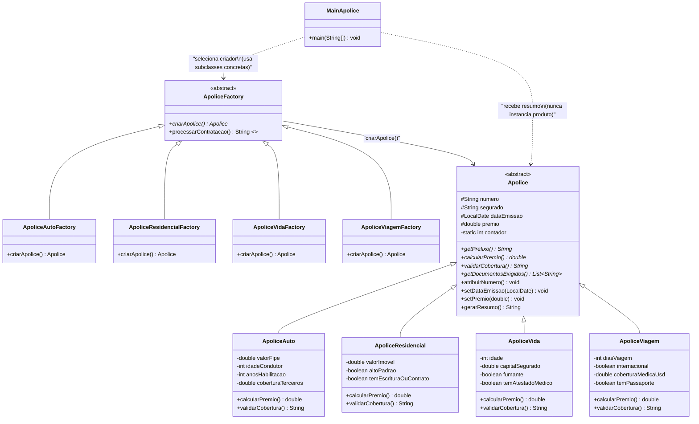

# Exercicio 1 - Factory Method: Sistema de Emissao de Apolices

## Diagrama de Classes UML

## Legenda

- `Apolice` (abstrata): declara os metodos comuns a toda apolice (calculo de premio,
  validacao de cobertura, listagem de documentos e geracao de resumo).
- `ApoliceFactory` (abstrata): declara o **metodo fabrica** abstrato `criarApolice()` e o
  metodo concreto e final `processarContratacao()`, que usa apenas a abstracao do produto.
- Subclasses concretas de criador: cada uma sobrescreve `criarApolice()` para retornar a
  apolice correspondente.
- `MainApolice` (cliente): seleciona o criador pelo tipo de apolice e nunca instancia
  diretamente uma classe concreta de produto.
