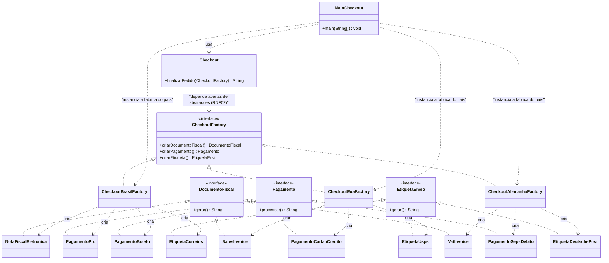

# Exercicio 2 - Abstract Factory: Checkout Internacional de Marketplace

## Diagrama de Classes UML

## Legenda

- `CheckoutFactory` (fabrica abstrata): declara um metodo para criar cada um dos tres
  artefatos do pedido. Por construcao, os tres artefatos de um pedido pertencem sempre ao
  mesmo pais (nenhuma combinacao invalida e possivel sem trocar a fabrica).
- Fabricas concretas por pais: `CheckoutBrasilFactory`, `CheckoutEuaFactory` e
  `CheckoutAlemanhaFactory` criam a familia completa de artefatos do respectivo pais.
- Interfaces de produto: `DocumentoFiscal`, `Pagamento` e `EtiquetaEnvio`, com produtos
  concretos por pais.
- `Checkout` (finalizador): usa somente a abstracao `CheckoutFactory` para gerar o
  relatorio padronizado, sem condicionais por pais (RNF02/RNF03).
- Extensao para um 4o pais: adicionar uma fabrica concreta + produtos novos, sem alterar
  nenhuma classe existente (RNF01).
