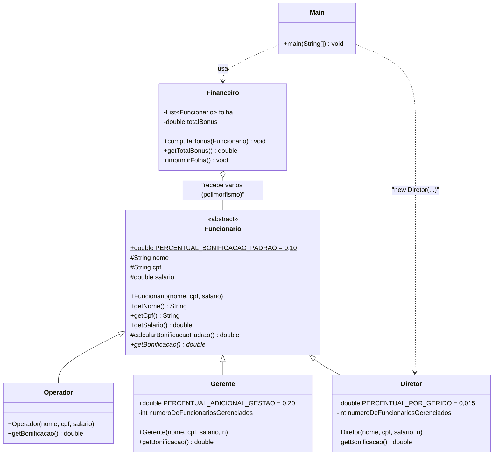

# UML — Herança, Polimorfismo e Classe Abstrata (Funcionário / Diretor)

Atividade: **implementar a classe `Diretor`**, cuja bonificação é
`(1,5% do salário) × número de funcionários sob sua gestão`.

## Diagrama de classes

## Fórmulas implementadas

| Classe | Fórmula da bonificação | Exemplo (salário R$ 20.000, 30 geridos) |
|---|---|---|
| `Operador` | `0,10 × salário` | R$ 150,00 (salário 1.500) |
| `Gerente` | `0,10 × salário + 0,20 × salário` | R$ 3.000,00 (salário 10.000) |
| `Diretor` | `0,10 × salário + (0,015 × salário × n.º geridos)` | 2.000 + 9.000 = **R$ 11.000,00** |

## Pontos que caem em prova

1. **`@Override`** — anotação que substitui a lógica de um método herdado.
   Se a assinatura não casar, o compilador acusa erro (proteção).
2. **`super`** — consome atributos/métodos **conforme implementados na classe base**.
   Mudanças na classe base refletem nas especializações.
3. **`abstract class`** — não pode ser instanciada (`new Funcionario()` não compila);
   serve para criar uma interface de uso polimórfico.
4. **`abstract method`** — método sem corpo; **obriga** todas as subclasses
   concretas a sobrescrevê-lo.
5. **ARMADILHA:** em Java **não existe** `super.metodoAbstrato()`. Se o método é
   abstrato na superclasse, `super.getBonificacao()` gera erro de compilação:
   `abstract method getBonificacao() in Funcionario cannot be accessed directly`.
   Solução: a regra reaproveitável fica em um método **`protected` e concreto**
   (`calcularBonificacaoPadrao()`), e o abstrato é o método polimórfico.
6. **Polimorfismo** — `Financeiro.computaBonus(Funcionario f)` aceita qualquer
   especialização; a JVM escolhe a implementação pela **classe real do objeto**
   (ligação tardia / *dynamic dispatch*).
