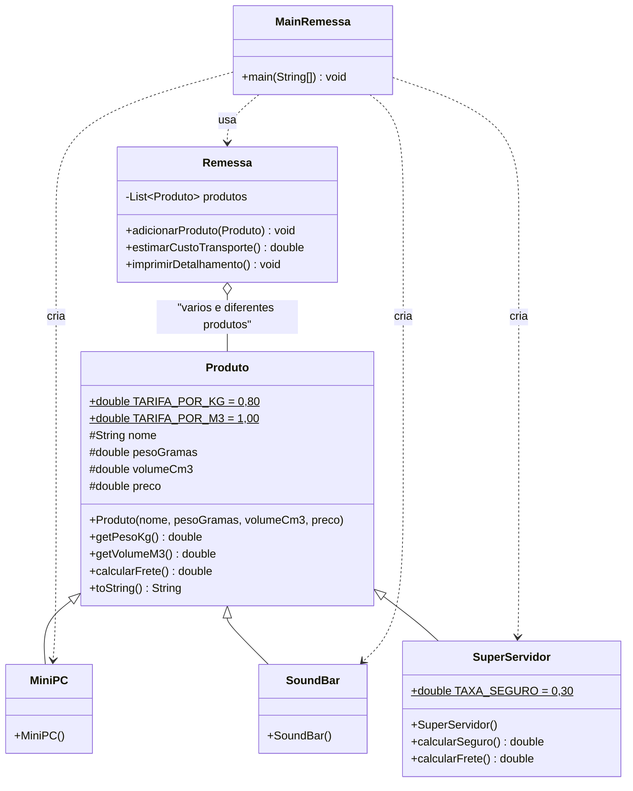

# UML — Sistema de remessas da indústria Coisas & Coisas (Frete)

Enunciado: um método que recebe **vários e diferentes produtos** e retorna a
**estimativa de custos de transporte**.

- Atributos comuns: `peso` (gramas), `volume` (cm³), `preço`.
- Frete geral: **R$ 0,80 por quilo de massa** + **R$ 1,00 por metro cúbico de volume**.
- `SuperServidor`: frete inclui **seguro de 30% do preço**.

## Diagrama de classes

## Memória de cálculo (confere com a saída do programa)

Conversões: **gramas ÷ 1000 = kg** e **cm³ ÷ 1.000.000 = m³**.

| Produto | peso | volume | cálculo do frete | frete |
|---|---|---|---|---|
| MiniPC | 500 g = 0,500 kg | 200 cm³ = 0,0002 m³ | 0,500×0,80 + 0,0002×1,00 | R$ 0,40 |
| SoundBar | 670 g = 0,670 kg | 8.000 cm³ = 0,008 m³ | 0,670×0,80 + 0,008×1,00 | R$ 0,54 |
| SuperServidor | 3.800 g = 3,800 kg | 120.000 cm³ = 0,12 m³ | 3,800×0,80 + 0,12×1,00 = 3,16 | + 30% × 30.000 = **R$ 9.003,16** |
| **Total da remessa** | | | 0,40 + 0,54 + 9.003,16 | **R$ 9.004,10** |

## Máximo reaproveitamento de código (o que o professor avalia)

1. A **regra geral** do frete está implementada **uma única vez**, na classe `Produto`.
2. `MiniPC` e `SoundBar` **não escrevem nenhuma linha de cálculo** — herdam tudo.
3. `SuperServidor` reaproveita o cálculo da base com `super.calcularFrete()` e
   soma apenas o que é específico (o seguro).
4. As tarifas são **constantes** (`static final`), sem números mágicos no meio do código.
5. `Remessa` **não pergunta o tipo do produto** (sem `if`/`instanceof`): só chama
   `calcularFrete()` — comportamento polimórfico.
