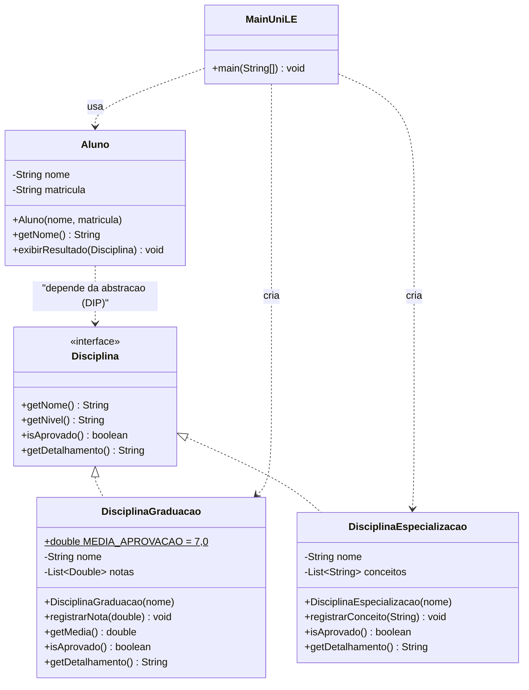

# UML — UniLE: Disciplinas de Graduação e Especialização

Enunciado: com atenção aos princípios **SOLID**, desenhar e implementar as classes
`disciplina` e `aluno`, determinando aprovação/reprovação.

- **Graduação**: notas de 0 a 10; média ≥ 7 → aprovado; média < 7 → reprovado.
- **Especialização**: conceitos {A, B, C, D}; **reprovado sempre que houver "D"**.

## Diagrama de classes

## SOLID aplicado (é isto que o enunciado cobra)

| Letra | Princípio | Como aparece na solução |
|---|---|---|
| **S** | Responsabilidade única | `Disciplina*` decide o resultado; `Aluno` apenas exibe. Uma razão para mudar cada classe. |
| **O** | Aberto/fechado | Um novo nível (mestrado) entra por **nova classe** que implementa `Disciplina`; nenhuma classe existente muda. |
| **L** | Substituição de Liskov | Qualquer `Disciplina` substitui a interface sem quebrar `Aluno.exibirResultado()`. |
| **I** | Segregação da interface | Interface enxuta: só o que o consumidor precisa (`nome`, `nível`, `isAprovado`, `detalhamento`). |
| **D** | Inversão da dependência | `Aluno` depende da **abstração** `Disciplina`, e não de `DisciplinaGraduacao`/`DisciplinaEspecializacao`. |

## Interface ou classe abstrata? (decisão de projeto)

Foi usada uma **interface** porque:

- o único elemento comum é o **contrato** (comportamento), não o estado;
- a graduação guarda `List<Double> notas`, a especialização guarda `List<String> conceitos`
  — **não há estado nem algoritmo comum para herdar**;
- interfaces são "mais restritivas" e determinam uma **carga mínima comum**
  (slide *Interfaces*), favorecendo o baixo acoplamento.

Se houvesse código comum (ex.: calcular frequência igual para os dois níveis),
o correto seria uma **classe abstrata** `Disciplina` com esse método concreto —
e, idealmente, mantendo também a interface para o contrato.

## Casos de teste verificados na execução

| Disciplina | Entradas | Média / conceitos | Resultado |
|---|---|---|---|
| Matemática (grad.) | 8,0 · 7,0 · 9,5 | média 8,17 | APROVADO |
| Física (grad.) | 5,0 · 6,0 · 7,0 | média 6,00 | REPROVADO |
| Algoritmos (grad.) | 7,0 · 7,0 | média 7,00 (limite) | APROVADO |
| Gestão de Projetos (esp.) | A · B | sem D | APROVADO |
| Arquitetura de Software (esp.) | A · B · D | contém D | REPROVADO |
