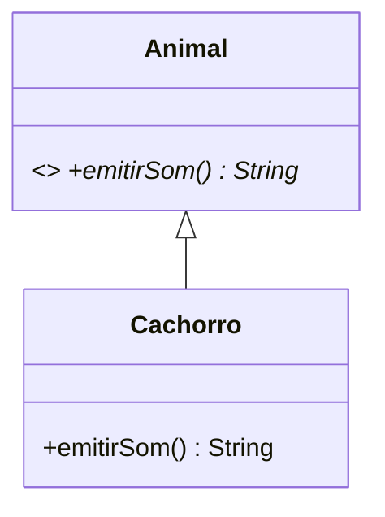

# CHEAT SHEET — Padrões de Projeto (1.º Bimestre)

> Consulta rápida para a prova. Perfil da avaliação: **projeto Java no VS Code,
> sem internet, sem IA, entrega pelo Git**. Foque em escrever a **estrutura do
> padrão** e em **justificar com SOLID**.

---

## 1. Escolha do padrão em 10 segundos (árvore de decisão)

```
O enunciado pede para criar OBJETOS sem o cliente depender das classes concretas?

├── UM produto (uma família de 1 objeto), a variação é "qual subclasse criar"
│     └── FACTORY METHOD
│         criador abstrato + método fábrica abstrato + subclasse de criador por produto
│
├── VÁRIOS produtos que devem ser usados JUNTOS / do mesmo "tema"
│     └── ABSTRACT FACTORY
│         fábrica abstrata com 1 método por produto + 1 fábrica concreta por família
│
├── UM objeto único compartilhado no sistema (config, conexão, log, pool)
│     └── SINGLETON
│
├── Copiar objetos complexos sem conhecer a classe concreta / sem repetir construtor
│     └── PROTOTYPE  (clone)
│
├── Avisar vários objetos quando UM muda de estado (1 → N)
│     └── OBSERVER
│
├── Simplificar o acesso a um subsistema complicado (1 método para N chamadas)
│     └── FACADE
│
├── Fazer uma interface existente funcionar com outra esperada (incompatível)
│     └── ADAPTER
│
└── Adicionar responsabilidades a um objeto DINAMICAMENTE, sem explosão de subclasses
      └── DECORATOR
```

**Palavras-chave que denunciam o padrão no enunciado:**

| Trecho do enunciado | Padrão |
|---|---|
| "não pode exigir alteração de nenhuma classe em produção, apenas adição de classes novas" | OCP → Factory Method / Abstract Factory |
| "os artefatos de um mesmo pedido precisam pertencer sempre ao mesmo país" | **Abstract Factory** (família de produtos) |
| "o cliente não pode conter estruturas condicionais que decidam qual classe usar" | Factory Method / Abstract Factory |
| "instância única", "global point of access" | Singleton |
| "novas instâncias a partir de um modelo existente", "cópia" | Prototype |
| "quando um objeto muda de estado, todos os dependentes são notificados" | Observer |
| "interface unificada para um conjunto de interfaces do subsistema" | Facade |
| "converter a interface de uma classe em outra interface esperada pelo cliente" | Adapter |
| "adicionar responsabilidades dinamicamente, sem alterar a estrutura" | Decorator |

---

## 2. SOLID — definição de uma linha + onde cada um aparece

| | Princípio | Definição de bolso | Aparece em |
|---|---|---|---|
| **S** | Single Responsibility | Uma classe, **um único motivo** para mudar. | Separar `Disciplina` de `Aluno`; separar cálculo de desconto de `Funcionario`. |
| **O** | Open/Closed | **Aberta para extensão, fechada para modificação**. | Novo produto/país entra por **nova classe**, sem tocar nas existentes. |
| **L** | Liskov Substitution | A subclasse **substitui** a base sem quebrar o programa. | `Financeiro` aceita qualquer `Funcionario`; `Disciplina` aceita qualquer nível. |
| **I** | Interface Segregation | Várias interfaces **específicas** > uma interface "gorda". | Interface `Disciplina` enxuta (`isAprovado`, `getNome`). |
| **D** | Dependency Inversion | Dependa de **abstrações**, não de implementações concretas. | `Aluno` recebe `Disciplina`; `Checkout` recebe `CheckoutFactory`. |

**Como citar na prova:** "A solução atende ao **OCP** porque novos produtos entram
por novas classes; e ao **DIP** porque o cliente depende apenas da abstração
`ApoliceFactory`, nunca de `ApoliceAuto`."

---

## 3. Os padrões em uma página cada

### 3.1 Factory Method — "delegar a criação às subclasses"

- **Intenção:** definir uma **interface para criar um objeto**, mas deixar as
  **subclasses decidirem qual classe instanciar**. Permite que a classe deixe a
  definição dos tipos específicos para as subclasses.
- **Quando usar:** quando se deseja criar objetos de um tipo específico **sem que
  o código cliente dependa das classes concretas**.
- **Participantes:** `Produto` (abstrato) · `ProdutoConcreto` · `Criador`
  (abstrato, com o **método fábrica**) · `CriadorConcreto` · `Cliente`.
- **Regra de ouro na prova:** o **método fábrica fica isolado nas subclasses de
  criador**; o **algoritmo de processamento fica centralizado na superclasse**
  (método concreto e **`final`**), e usa **apenas a abstração do produto**.

```java
// PRODUTO ABSTRATO
public abstract class Produto {
    public abstract double calcular();
    public String resumo() { return "Total: " + calcular(); } // algoritmo comum
}

// PRODUTOS CONCRETOS
public class ProdutoA extends Produto { public double calcular() { return 10.0; } }
public class ProdutoB extends Produto { public double calcular() { return 20.0; } }

// CRIADOR ABSTRATO: método fábrica + algoritmo concreto e final
public abstract class Criador {
    protected abstract Produto criarProduto();   // <<< MÉTODO FÁBRICA
    public final String processar() {            // algoritmo NÃO varia
        Produto p = criarProduto();              // só a abstração é usada
        return p.resumo();
    }
}

// CRIADORES CONCRETOS: cada um instancia o seu produto
public class CriadorA extends Criador { protected Produto criarProduto() { return new ProdutoA(); } }
public class CriadorB extends Criador { protected Produto criarProduto() { return new ProdutoB(); } }

// CLIENTE: escolhe o criador, nunca instancia produto concreto
public class Main {
    public static void main(String[] args) {
        Criador c = new CriadorA();       // trocar aqui = trocar o produto
        System.out.println(c.processar());
    }
}
```

**Erros que zeram o critério "ausência de condicionais":**
`if (tipo.equals("A")) return new ProdutoA();` **dentro** do cliente ou da
superclasse de criador. A decisão deve estar **na escolha do criador concreto**.

---

### 3.2 Abstract Factory — "famílias de produtos que combinam entre si"

- **Intenção:** fornecer uma interface para criar **famílias de objetos
  relacionados** sem especificar suas classes concretas. Encapsula grupos de
  fábricas e controla como o cliente acessa tais fábricas.
- **Diferença essencial do Factory Method:** Factory Method cria **um** produto
  (herança, subclasse decide); Abstract Factory cria **uma família de vários
  produtos** (composição: o cliente recebe a fábrica pronta).
- **Garantia estrutural:** como **uma única fábrica** cria **todos** os produtos,
  é **impossível** combinar produtos de famílias diferentes sem trocar a fábrica.

```java
// PRODUTOS (interfaces) — 3 famílias de artefatos
public interface DocumentoFiscal { String gerar(); }
public interface Pagamento       { String processar(); }
public interface EtiquetaEnvio   { String gerar(); }

// PRODUTOS CONCRETOS por família (Brasil)
class NotaFiscal implements DocumentoFiscal { public String gerar() { return "NF-e"; } }
class Pix        implements Pagamento       { public String processar() { return "Pix"; } }
class Correios   implements EtiquetaEnvio   { public String gerar() { return "CEP 00000-000"; } }

// FÁBRICA ABSTRATA: 1 método por produto da família
public interface FabricaPais {
    DocumentoFiscal criarDocumentoFiscal();
    Pagamento       criarPagamento();
    EtiquetaEnvio   criarEtiqueta();
}

// FÁBRICA CONCRETA: cria a FAMÍLIA INTEIRA do país
public class FabricaBrasil implements FabricaPais {
    public DocumentoFiscal criarDocumentoFiscal() { return new NotaFiscal(); }
    public Pagamento       criarPagamento()       { return new Pix(); }
    public EtiquetaEnvio   criarEtiqueta()        { return new Correios(); }
}

// CLIENTE: depende SÓ da abstração; nenhum if por país
public class Checkout {
    public String finalizar(FabricaPais fabrica) {
        return fabrica.criarDocumentoFiscal().gerar() + "\n"
             + fabrica.criarPagamento().processar() + "\n"
             + fabrica.criarEtiqueta().gerar();
    }
}
```

**Extensão para um 4.º país:** adicionar **1 fábrica concreta + N produtos
concretos**. **Zero** classes existentes alteradas (RNF01/OCP).

---

### 3.3 Singleton — "uma única instância"

```java
public class Configuracao {
    private static Configuracao instancia;          // atributo estático

    private Configuracao() { }                      // construtor PRIVADO

    public static synchronized Configuracao getInstance() {   // acesso global
        if (instancia == null) {
            instancia = new Configuracao();
        }
        return instancia;
    }
}
```
Pontos de prova: construtor **privado** · atributo **`static`** · método
**`static`** de acesso · `synchronized` para *thread safety*.
Variante *eager*: `private static final Configuracao INSTANCIA = new Configuracao();`.

---

### 3.4 Prototype — "clonar em vez de construir"

```java
public abstract class Forma implements Cloneable {
    protected String cor;
    public abstract Forma clonar();
    public void setCor(String cor) { this.cor = cor; }
}

public class Circulo extends Forma {
    private double raio;
    public Circulo(double raio) { this.raio = raio; }
    @Override public Forma clonar() {
        try { return (Circulo) super.clone(); }        // cópia rasa
        catch (CloneNotSupportedException e) { throw new RuntimeException(e); }
    }
}
```
Obs.: para cópia **profunda**, clone também os objetos internos (listas, etc.).

---

### 3.5 Observer — "1 muda, N são notificados"

```java
public interface Observador { void atualizar(); }

public class Assunto {
    private final List<Observador> observadores = new ArrayList<>();
    private int estado;

    public void attach(Observador o) { observadores.add(o); }
    public int getEstado() { return estado; }
    public void setEstado(int estado) {
        this.estado = estado;
        notificarTodos();                     // notifica ao MUDAR DE ESTADO
    }
    private void notificarTodos() {
        for (Observador o : observadores) o.atualizar();
    }
}

public class ObservadorConcreto implements Observador {
    private final Assunto assunto;
    public ObservadorConcreto(Assunto assunto) {
        this.assunto = assunto;
        this.assunto.attach(this);            // auto-registro no construtor
    }
    @Override public void atualizar() {
        System.out.println("Novo estado: " + assunto.getEstado());
    }
}
```

---

### 3.6 Facade — "uma porta de entrada simples"

```java
public class FachadaComputador {
    private Cpu cpu = new Cpu();
    private Memoria memoria = new Memoria();
    private Disco disco = new Disco();

    public void ligar() {                     // 1 chamada -> N subsistemas
        cpu.iniciar();
        memoria.carregar();
        disco.ler();
    }
}
```
Não impede o acesso direto ao subsistema; apenas **simplifica** o uso comum.

---

### 3.7 Adapter — "traduzir uma interface para outra"

```java
public interface Alvo { String requisicao(); }          // o que o cliente espera

public class Adaptado {                                  // interface incompatível
    public String requisicaoEspecifica() { return "formato antigo"; }
}

public class Adaptador implements Alvo {                 // composição
    private final Adaptado adaptado;
    public Adaptador(Adaptado adaptado) { this.adaptado = adaptado; }
    @Override public String requisicao() { return adaptado.requisicaoEspecifica(); }
}
```

---

### 3.8 Decorator — "camadas de responsabilidade em tempo de execução"

```java
public interface Bebida { String descricao(); double preco(); }

public class Cafe implements Bebida {                    // componente concreto
    public String descricao() { return "Cafe"; }
    public double preco()     { return 3.0; }
}

public abstract class Condimento implements Bebida {     // decorador abstrato
    protected final Bebida bebida;                       // MANTÉM referência
    public Condimento(Bebida bebida) { this.bebida = bebida; }
}

public class Leite extends Condimento {                  // decorador concreto
    public Leite(Bebida bebida) { super(bebida); }
    public String descricao() { return bebida.descricao() + ", leite"; }
    public double preco()     { return bebida.preco() + 0.5; }   // SOMA
}

// USO: empilhar decoradores
Bebida b = new Cafe();
b = new Leite(b);
b = new Acucar(b);
System.out.println(b.descricao() + " = " + b.preco());
```
Diferença para herança: no Decorator as responsabilidades são **combinadas
dinamicamente**, evitando a **explosão de subclasses** (LeiteComAcucar,
LeiteSemAcucar, ...).

---

## 4. Cola de sintaxe Java (para não perder ponto bobo)

```java
// ---- Herança / polimorfismo -------------------------------------------
public abstract class Animal {                 // abstract: NÃO instanciável
    protected String nome;
    public Animal(String nome) { this.nome = nome; }
    public abstract String emitirSom();        // SEM corpo
}
public class Cachorro extends Animal {
    public Cachorro(String nome) { super(nome); }   // chama o construtor da base
    @Override public String emitirSom() { return "latido"; }
}
Animal a = new Cachorro("Rex");                // referência base, objeto filho
a.emitirSom();                                 // ligação tardia (polimorfismo)

// ---- Interfaces -------------------------------------------------------
public interface Disciplina {                  // contrato: só assinaturas
    String getNome();                          // implicitamente public abstract
    boolean isAprovado();
}
public class Graduacao implements Disciplina { // implements (não extends)
    public String getNome() { return "X"; }
    public boolean isAprovado() { return true; }
}

// ---- super ------------------------------------------------------------
super.metodo();          // método da superclasse  (NÃO funciona se for abstract)
super(atributos);        // chamar o construtor da superclasse (1.ª linha!)

// ---- Coleções ---------------------------------------------------------
import java.util.*;                            // ou import específico
List<String> lista = new ArrayList<>();        // SEMPRE a interface à esquerda
lista.add("a"); lista.get(0); lista.size();
Map<String,Integer> m = new HashMap<>();
m.put("k", 1); m.get("k"); m.containsKey("k");
for (String s : lista) { }                     // for-each
List.of("a","b");                              // lista imutável (Java 9+)

// ---- Números ----------------------------------------------------------
double x = 1234.5;
System.out.printf("%.2f%n", x);                // 1234,50  (%n = quebra de linha)
System.out.printf("%-12s|%8.2f%n", "abc", x);  // alinhamentos
Math.round(x);                                 // arredondar
"%.2f".formatted(x);                           // Java 15+
// ATENÇÃO: em Java use PONTO decimal no código (0.08), mesmo em pt-BR.

// ---- Strings ----------------------------------------------------------
s.equals("x")         // NUNCA s == "x"
s.equalsIgnoreCase("x"); s.toUpperCase(); s.trim();
String.join(", ", lista);
s.substring(0, 3);

// ---- Conversões de unidade (muito usado no frete) ----------------------
double kg = gramas / 1000.0;      // 500 g -> 0.5 kg
double m3 = cm3 / 1_000_000.0;    // 200 cm3 -> 0.0002 m3

// ---- Exceções ---------------------------------------------------------
public void registrar(double nota) {
    if (nota < 0 || nota > 10) {
        throw new IllegalArgumentException("Nota invalida: " + nota);
    }
}
try { ... } catch (IllegalArgumentException e) { System.out.println(e.getMessage()); }
```

**Regras de arquivo/compilação (erros clássicos na prova):**
- 1 classe `public` por arquivo, **com o mesmo nome do arquivo** (`Cachorro.java`).
- Classes **não** públicas podem ficar no mesmo arquivo, mas o professor precisa
  achar as coisas — prefira 1 arquivo por classe.
- Nome do pacote (`package x;`) deve casar com a pasta; em prova, **evite pacotes**
  para não errar caminho.
- `javac *.java` compila tudo; `java ClasseComMain` executa.
- Esquecer `@Override` não quebra, mas perde ponto de "sobrescrita explícita".
- Sobrescrever `equals` sem sobrescrever `hashCode` é erro conceitual.
- `List.of(...)` é **imutável**; use `new ArrayList<>(List.of(...))` se precisar alterar.

---

## 5. Checklist final antes de entregar (o professor cobra isto)

- [ ] O **cliente não tem `if`/`switch` decidindo tipo de produto**.
- [ ] O **método fábrica está isolado nas subclasses** de criador.
- [ ] O **algoritmo de processamento está na superclasse** e é `final`.
- [ ] O cliente **nunca** faz `new ProdutoConcreto()`.
- [ ] **Diagrama UML** bate com o código (nomes, atributos, métodos, setas).
- [ ] Existe uma classe **`main` de teste** que cobre **sucesso E rejeição**.
- [ ] O código **compila** (`javac`) e **executa** sem erro.
- [ ] Comentários curtos citando o **RF/RNF** e o **padrão/SOLID** aplicados.
- [ ] Entrega **pelo Git** (a avaliação exige; commit + push).
- [ ] Wi-Fi **desligado** durante a prova; religar só na hora de entregar.

---

## 6. Setas do diagrama UML (notação)

| Notação | Significado |
|---|---|
| `A <|-- B` | B **herda** de A (generalização, triângulo vazado) |
| `A <|.. B` | B **implementa** a interface A (triângulo vazado, linha tracejada) |
| `A --> B` | A **conhece** B (associação) |
| `A ..> B` | A **depende de** B (dependência, linha tracejada) |
| `A o-- B` | **Agregação** (B pode viver sem A; losango vazado) |
| `A *-- B` | **Composição** (B morre com A; losango cheio) |
| `A ..|> B` | B **realiza** A (Mermaid, mesma ideia de `<|..`) |

No **Mermaid** (que renderiza no VS Code e no GitHub):

````

````
`<<abstract>>` e `<<interface>>` são estereótipos; `*` marca método abstrato.
