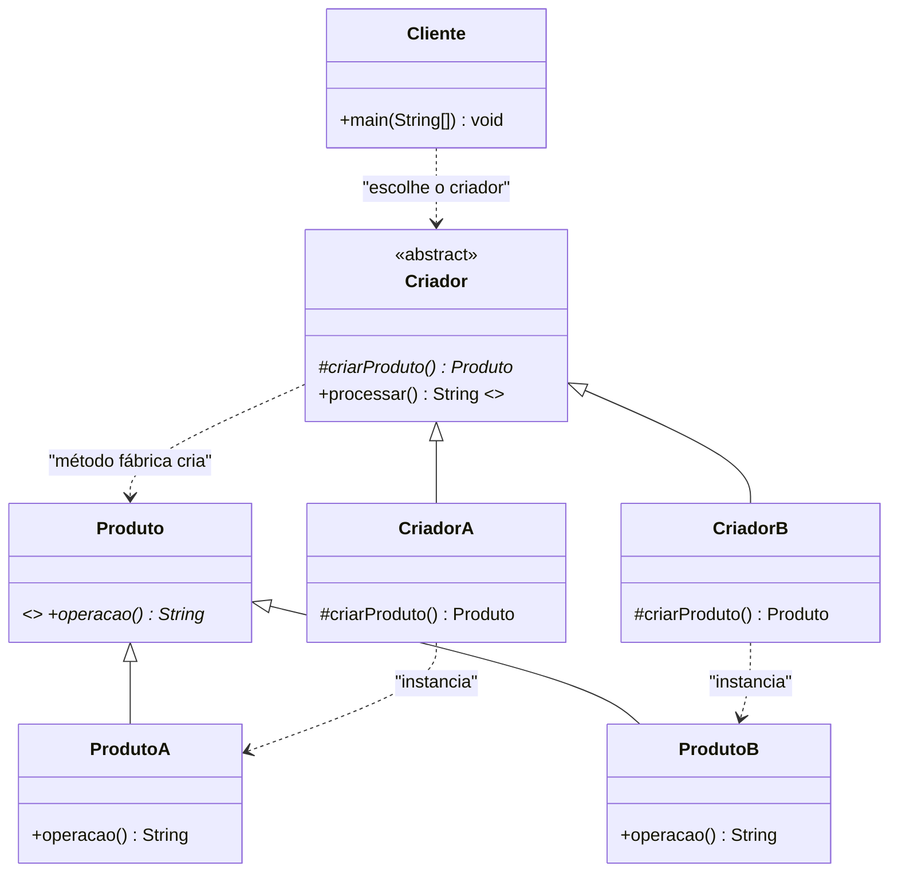
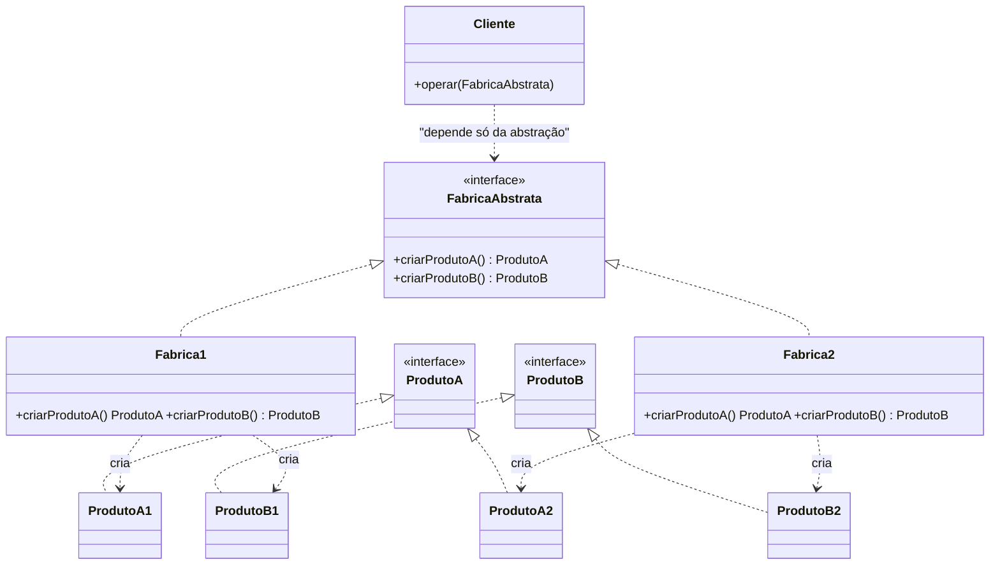

# GUIA DE BOLSO — Escrever Padrões de Projeto no Papel e no VS Code

> Objetivo: permitir **reconstruir a estrutura de qualquer padrão da ementa** em
> poucos minutos, sem consultar outra fonte. Cada padrão vem com:
> **intenção → estrutura (UML) → template Java mínimo → quando usar → erros que zeram ponto**.

---

## PARTE 0 — Fundamentos (a base de tudo)

### 0.1 Herança

Técnica para **implementar métodos e propriedades comuns a diversas classes uma
só vez**, evitando repetição de código.

```java
public class Funcionario {                  // classe base
    protected String nome;                  // protected: visível nas filhas
    protected double salario;

    public Funcionario(String nome, double salario) {
        this.nome = nome;
        this.salario = salario;
    }
    public double getBonificacao() { return 0.10 * salario; }
}

public class Gerente extends Funcionario {  // classe especializada
    private int subordinados;

    public Gerente(String nome, double salario, int subordinados) {
        super(nome, salario);               // 1.ª linha do construtor
        this.subordinados = subordinados;
    }

    @Override                               // substitui a lógica herdada
    public double getBonificacao() {
        return super.getBonificacao() + (0.20 * salario);  // consome a base
    }
}
```

**O que a anotação `@Override` faz:** informa ao compilador que o método
**substitui** um método herdado. Se a assinatura estiver errada, ele **acusa erro**
(proteção contra bugs silenciosos).

**O que `super` faz:** consome atributos ou métodos **conforme implementados na
classe base**. Se a regra base mudar, a subclasse acompanha automaticamente.

**Armadilha de prova:** `super.metodoAbstrato()` **não compila**:
`error: abstract method X() cannot be accessed directly`.
Solução: mantenha a regra reaproveitável em um método **`protected` e concreto**.

### 0.2 Polimorfismo

Garante a execução de **diferentes comportamentos a partir de referências de
objetos distintos**. O método recebe a **classe base** (ou interface) como
parâmetro e processa qualquer subclasse, **desde que as assinaturas sejam iguais**.

```java
public class Financeiro {
    private double total = 0;
    public void computaBonus(Funcionario f) {   // aceita Gerente, Operador, Diretor...
        total += f.getBonificacao();            // ligação TARDIA (runtime)
    }
}

Funcionario f = new Gerente("Ana", 10000, 10); // referência base, objeto filho
f.getBonificacao();                             // executa a versão do Gerente
```

Analogia do professor: uma cancela de pedágio aceita **veículo**; se
**motocicleta é subclasse de veículo**, ela é aceita sem alterar a cancela.

### 0.3 Classe abstrata × método abstrato × interface

| Recurso | Pode instanciar? | Tem corpo? | Palavra-chave | Papel |
|---|---|---|---|---|
| Classe concreta | Sim | Sim | `class` | Implementação completa |
| **Classe abstrata** | **Não** | Pode ter os dois | `abstract class` | Base parcial: código comum + contrato |
| **Método abstrato** | — | **Não** | `abstract` | Obriga a subclasse a implementar |
| **Interface** | Não | Não (até Java 7) | `interface` | **Contrato** mínimo comum |

```java
public abstract class Funcionario {
    protected double salario;
    public abstract double getBonificacao();   // cada subclasse decide
    public double getSalario() { return salario; }  // concreto e comum
}

public interface Disciplina {                  // contrato (o que fazer)
    String getNome();
    boolean isAprovado();
}
```

**Como decidir em prova:**

- Há **estado + código comum** para reaproveitar → **classe abstrata**.
- Há apenas **contrato** (comportamento comum sem estado/comum algoritmo), ou
  preciso de **herança múltipla de tipo** → **interface**.
- Interfaces são **mais restritivas** que classes abstratas e favorecem o
  **empacotamento** da aplicação.

### 0.4 SOLID (resumo aplicado)

Já detalhado no Cheat Sheet; memorize a frase-chave de cada um:
**S** um motivo para mudar · **O** estender sem modificar · **L** subclasse
substitui a base · **I** interfaces específicas · **D** depender de abstrações.

---

## PARTE 1 — Padrões de criação

### 1.1 FACTORY METHOD ⭐ (o mais provável na prova)

**Intenção:** definir uma **interface para criação de um objeto**, mas **delegar
às subclasses a definição de qual classe será instanciada**. Permite que uma
classe deixe a definição dos tipos específicos como responsabilidade das
subclasses.

**Quando usar:** quando se deseja criar objetos de um tipo específico, mas **não
se deseja que o código cliente dependa das classes concretas** desses objetos.
Amplamente usado em frameworks, bibliotecas e APIs para criar objetos de maneira
flexível e extensível.

**Estrutura UML**



**Template Java (memorize esta ordem: 4 blocos)**

```java
// (1) PRODUTO ABSTRATO -------------------------------------------------
public abstract class Apolice {
    protected String numero;
    public abstract String getPrefixo();
    public abstract double calcularPremio();
    public abstract String validarCobertura();       // null = válido
    public abstract List<String> getDocumentos();

    public String gerarResumo() {                    // algoritmo COMUM
        return "Apolice " + numero + " - Premio R$ " +
               String.format("%.2f", calcularPremio());
    }
}

// (2) PRODUTOS CONCRETOS ---------------------------------------------- 
public class ApoliceAuto extends Apolice {
    public String getPrefixo() { return "AUTO-"; }
    public double calcularPremio() { return 0.08 * 80000 / 12; }
    public String validarCobertura() { return null; }
    public List<String> getDocumentos() { return List.of("CNH", "CRLV"); }
}

// (3) CRIADOR ABSTRATO + CRIADORES CONCRETOS --------------------------
public abstract class ApoliceFactory {
    public abstract Apolice criarApolice();          // <<< MÉTODO FÁBRICA

    public final String processarContratacao() {     // concreto e FINAL
        Apolice a = criarApolice();                  // só a abstração!
        String motivo = a.validarCobertura();
        if (motivo != null) return "REJEITADA - " + motivo;
        return a.gerarResumo();
    }
}

public class ApoliceAutoFactory extends ApoliceFactory {
    @Override public Apolice criarApolice() { return new ApoliceAuto(); }
}

// (4) CLIENTE: escolhe o criador, jamais o produto ---------------------
public class Main {
    public static void main(String[] args) {
        ApoliceFactory f = new ApoliceAutoFactory();   // <- única decisão
        System.out.println(f.processarContratacao());
    }
}
```

**Erros que zeram o critério de avaliação:**

- ❌ `if`/`switch` decidindo o tipo de produto **na classe cliente**.
- ❌ `if`/`switch` decidindo o tipo **na superclasse de criador**.
- ❌ Cliente fazendo `new ApoliceAuto(...)` diretamente.
- ❌ Método fábrica retornando tipo concreto em vez da abstração.
- ❌ Algoritmo de processamento reimplementado em cada criador concreto
  (deve ficar **uma vez** na superclasse, `final`).

---

### 1.2 ABSTRACT FACTORY ⭐

**Intenção:** fornecer uma interface para criar **famílias de objetos
relacionados ou dependentes** sem especificar suas classes concretas.
**Encapsula grupos de fábricas** e controla como o cliente acessa tais fábricas.

**Sinal no enunciado:** exigência de **consistência entre vários produtos**
("os três artefatos de um mesmo pedido precisam pertencer sempre ao mesmo país").

**Diferença para o Factory Method:**

| | Factory Method | Abstract Factory |
|---|---|---|
| Cria | **1** produto | **Família** de N produtos |
| Mecanismo | **Herança**: subclasse de criador decide | **Composição**: o cliente recebe a fábrica |
| Métodos fábrica | 1 | N (um por produto) |
| Foco | Qual **subclasse** instanciar | Qual **família** usar, garantindo compatibilidade |

**Estrutura UML**



**Template Java**

```java
// PRODUTOS: 1 interface por tipo de artefato
public interface DocumentoFiscal { String gerar(); }
public interface Pagamento       { String processar(); }
public interface EtiquetaEnvio   { String gerar(); }

// PRODUTOS CONCRETOS da família BRASIL
public class NotaFiscalEletronica implements DocumentoFiscal {
    public String gerar() { return "NF-e CFOP " + (inter ? "6.102" : "5.102"); }
}
public class PagamentoPix implements Pagamento {
    public String processar() { return "Pix com 5% de desconto"; }
}
public class EtiquetaCorreios implements EtiquetaEnvio {
    public String gerar() { return "CEP 00000-000"; }
}

// FÁBRICA ABSTRATA
public interface CheckoutFactory {
    DocumentoFiscal criarDocumentoFiscal();
    Pagamento       criarPagamento();
    EtiquetaEnvio   criarEtiqueta();
}

// FÁBRICA CONCRETA = FAMÍLIA COMPLETA de um país
public class CheckoutBrasilFactory implements CheckoutFactory {
    public DocumentoFiscal criarDocumentoFiscal() { return new NotaFiscalEletronica(); }
    public Pagamento       criarPagamento()       { return new PagamentoPix(); }
    public EtiquetaEnvio   criarEtiqueta()        { return new EtiquetaCorreios(); }
}

// CLIENTE: recebe a fábrica pronta; ZERO condicionais por país
public class Checkout {
    public String finalizarPedido(CheckoutFactory factory) {
        return factory.criarDocumentoFiscal().gerar() + "\n"
             + factory.criarPagamento().processar() + "\n"
             + factory.criarEtiqueta().gerar();
    }
}
```

**Por que a combinação inválida é impossível:** o cliente **não tem acesso** aos
construtores dos produtos; ele só recebe objetos através de **uma** fábrica. Para
misturar países seria preciso **trocar a fábrica no meio do método**, o que
altera o código cliente — exatamente o que o enunciado proíbe.

**Extensão (avaliada na prova):** novo país = **1 fábrica concreta + N produtos
concretos**. Nenhuma classe existente é alterada → **OCP** satisfeito.

---

### 1.3 SINGLETON

**Intenção:** garantir que uma classe tenha **apenas uma instância** e fornecer
um **ponto de acesso global** a ela.

```java
public class GerenciadorConfig {
    private static GerenciadorConfig instancia;      // (1) static
    private GerenciadorConfig() { }                  // (2) construtor PRIVADO

    public static GerenciadorConfig getInstance() {  // (3) acesso global
        if (instancia == null) {                     // (4) criação preguiçosa
            instancia = new GerenciadorConfig();
        }
        return instancia;
    }
}
```
Thread-safe: `public static synchronized ...` ou *holder* / `enum`:

```java
public enum Config { INSTANCIA; public void usar() { } }   // à prova de reflexão
```

---

### 1.4 PROTOTYPE

**Intenção:** criar novos objetos **copiando** instâncias existentes
(projótipos), sem acoplar o cliente às classes concretas.

```java
public interface Prototipo { Prototipo clonar(); }

public class Contrato implements Prototipo {
    private String cliente;
    private List<String> clausulas = new ArrayList<>();

    @Override
    public Contrato clonar() {                       // cópia PROFUNDA da lista
        Contrato novo = new Contrato();
        novo.cliente = this.cliente;
        novo.clausulas = new ArrayList<>(this.clausulas);
        return novo;
    }
}
```
Alternativa Java: `implements Cloneable` + `super.clone()` (**cópia rasa** —
cuidado com listas/objetos internos compartilhados).

---

## PARTE 2 — Padrões estruturais

### 2.1 FACADE

**Intenção:** fornecer uma **interface unificada** para um conjunto de interfaces
de um subsistema, tornando-o mais fácil de usar.

```java
public class FachadaLoja {
    private Estoque estoque = new Estoque();
    private Pagamento pagamento = new Pagamento();
    private NotaFiscal nota = new NotaFiscal();

    public void comprar(String produto, double valor) {   // 1 método simples
        estoque.baixar(produto);
        pagamento.cobrar(valor);
        nota.emitir();
    }
}
```

### 2.2 ADAPTER

**Intenção:** **converter** a interface de uma classe em outra interface que o
cliente espera, permitindo que classes com interfaces incompatíveis trabalhem
juntas.

```java
public interface TomadaBrasileira { void fornecerEnergia(); }   // ALVO

public class TomadaAmericana {                                  // ADAPTADO
    public void plugarTresPinos() { System.out.println("110V"); }
}

public class AdaptadorTomada implements TomadaBrasileira {       // ADAPTADOR
    private final TomadaAmericana americana;                     // composição
    public AdaptadorTomada(TomadaAmericana a) { this.americana = a; }
    @Override public void fornecerEnergia() { americana.plugarTresPinos(); }
}
```
Variantes: **por composição** (acima, mais comum) ou **por herança**
(`extends Adaptado implements Alvo`).

### 2.3 DECORATOR

**Intenção:** adicionar responsabilidades a objetos **dinamicamente**, sem
alterar sua estrutura. Alternativa flexível à herança para estender
funcionalidades.

**Componentes (o professor listou os 4):**
1. **Componente Abstrato** — interface comum aos objetos que podem ser decorados.
2. **Componente Concreto** — o objeto original que pode ser decorado.
3. **Decorador Abstrato** — herda/implementa o Componente **e mantém uma
   referência** a um Componente.
4. **Decorador Concreto** — implementa o decorador abstrato e **adiciona**
   funcionalidade, podendo chamar a operação do componente antes ou depois.

```java
public interface Bebida { String descricao(); double preco(); }      // 1

public class Cafe implements Bebida {                                // 2
    public String descricao() { return "Cafe"; }
    public double preco()     { return 3.0; }
}

public abstract class Condimento implements Bebida {                 // 3
    protected final Bebida bebida;
    public Condimento(Bebida bebida) { this.bebida = bebida; }
}

public class Leite extends Condimento {                              // 4
    public Leite(Bebida bebida) { super(bebida); }
    public String descricao() { return bebida.descricao() + ", leite"; }
    public double preco()     { return bebida.preco() + 0.5; }
}

// Uso: decoradores "empilhados"
Bebida b = new Acucar(new Leite(new Cafe()));
```

**Diferença para herança:** com herança, N opcionais geram **2^N subclasses**
(explosão). Com Decorator, **N classes** combináveis em tempo de execução.
Promove o **princípio aberto/fechado**.

---

## PARTE 3 — Padrão comportamental

### 3.1 OBSERVER

**Intenção:** criar uma dependência **um-para-muitos** entre objetos, de modo que
quando **um** objeto muda de estado, **todos** os seus observadores sejam
**notificados e atualizados automaticamente**.

```java
public interface Observador { void atualizar(); }

public class Assunto {                                     // SUBJECT (observado)
    private final List<Observador> observadores = new ArrayList<>();
    private int estado;
    public int getEstado() { return estado; }
    public void setEstado(int estado) {
        this.estado = estado;
        notificarTodos();
    }
    public void attach(Observador o) { observadores.add(o); }
    private void notificarTodos() {
        for (Observador o : observadores) o.atualizar();
    }
}

public class ObservadorConcreto implements Observador {
    private final Assunto assunto;
    public ObservadorConcreto(Assunto assunto) {
        this.assunto = assunto;
        assunto.attach(this);                    // auto-registro
    }
    @Override public void atualizar() {
        System.out.println("Novo estado: " + assunto.getEstado());
    }
}
```
Usos reais: eventos de UI, notificações, *listeners*, *publish/subscribe*.

---

## PARTE 4 — Como justificar na prova (modelos de frase)

- **Factory Method:** "O método fábrica `criarApolice()` está declarado abstrato
  na superclasse `ApoliceFactory` e sobrescrito apenas nas subclasses de criador.
  O algoritmo `processarContratacao()` é concreto e `final`, centralizado na
  superclasse, e utiliza somente a abstração `Apolice`. O cliente `Main` escolhe
  o criador adequado e nunca instancia uma classe concreta de produto, portanto
  **não há condicionais que decidam o tipo do produto**."
- **Abstract Factory:** "Os três artefatos são criados por uma única fábrica
  concreta (`CheckoutBrasilFactory`), o que garante **estruturalmente** que
  documento fiscal, pagamento e etiqueta pertençam sempre ao mesmo país. O
  cliente `Checkout` depende apenas da interface `CheckoutFactory` (**DIP**) e a
  adição de um quarto país exige apenas novas classes, sem alterar as existentes
  (**OCP/RNF01**)."
- **SOLID:** cite sempre a letra **e** o efeito prático no código.

## PARTE 5 — Roteiro de 10 minutos para começar a prova

1. **Leia o enunciado e circule** os verbos de requisito ("criar", "validar",
   "calcular") e as restrições ("sem condicionais", "sem alterar classes").
2. **Decida o padrão** usando a árvore de decisão do Cheat Sheet.
3. **Liste as classes** e escreva os nomes antes de codar (abstrato +
   concretos + fábrica + cliente).
4. **Escreva primeiro as abstrações** (superclasse/interface) e os métodos
   abstratos; depois os concretos; por último o cliente.
5. **Compile cedo** (`javac *.java`) para não descobrir erros no fim.
6. **Rode a `main`** e confira a saída contra o enunciado (valores calculados).
7. **Desenhe o UML** com os mesmos nomes do código.
8. **Comite e faça push**; avise o professor para religar a internet.
