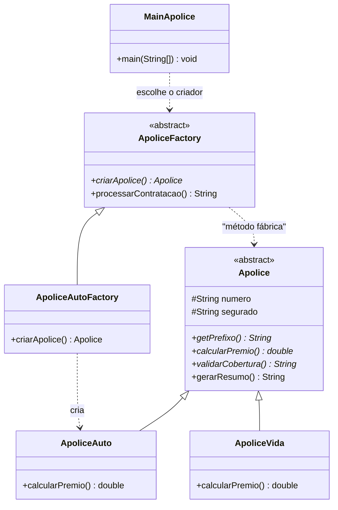
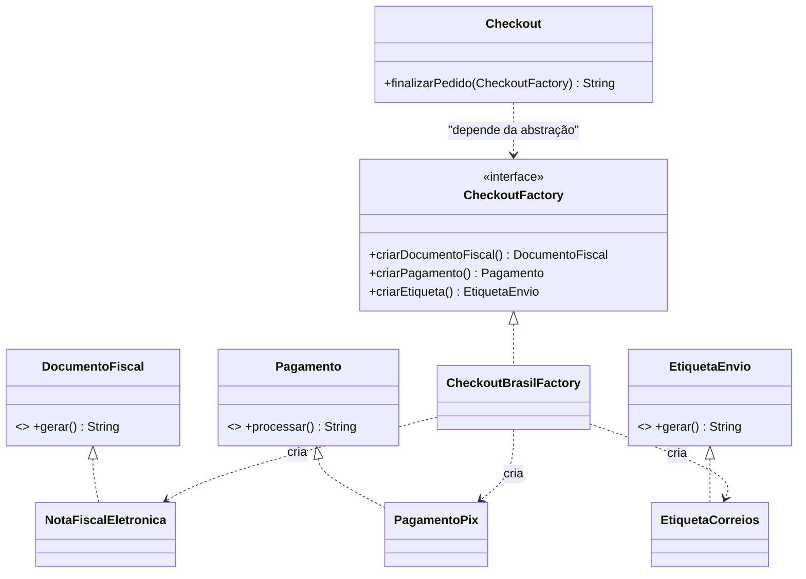

# REFERÊNCIA DE SINTAXE — Diagramas de Classe UML

> Use este arquivo quando a prova pedir o **diagrama UML** ("diagrama de classes
> UML completo"). Ele traz a notação oficial e o equivalente em Mermaid
> (renderiza no VS Code com a extensão *Markdown Preview Mermaid Support* e
> também no GitHub).

---

## 1. O retângulo da classe (as 3 divisórias)

```
+---------------------------------------------+
|            NomeDaClasse                     |  <- 1) NOME
|            <<interface>> / <<abstract>>     |     (estereótipo, se houver)
+---------------------------------------------+
| - atributoPrivado : Tipo                    |  <- 2) ATRIBUTOS
| # atributoProtegido : Tipo                  |     (visibilidade + tipo)
| + ATRIBUTO_CONSTANTE : double = 0.80        |
+---------------------------------------------+
| + metodoPublico(param : Tipo) : Retorno     |  <- 3) MÉTODOS
| - metodoPrivado() : void                    |
| + metodoAbstrato() : String  {abstract}     |
+---------------------------------------------+
```

### Visibilidade (símbolos)

| Símbolo | Modificador Java | Significado |
|---|---|---|
| `+` | `public` | visível a todos |
| `-` | `private` | visível só na classe |
| `#` | `protected` | visível na classe e nas filhas |
| `~` | *(default)* | visível no pacote |

### Modificadores de método/atributo

| Notação | Java |
|---|---|
| `{abstract}` ou nome em *itálico* | `abstract` |
| `{static}` ou **sublinhado** | `static` |
| `{final}` | `final` |
| `<<interface>>` | `interface` |
| `<<abstract>>` | `abstract class` |

### Tipo e multiplicidade

```
- nome : String
- notas : List<Double>        →  escreve-se  List~Double~  em Mermaid
- itens : Produto [0..*]       →  multiplicidade de associação
+ calcular(a : double, b : int) : double
```

---

## 2. Relacionamentos (as setas)

| Relação | UML (desenho) | Mermaid | Java correspondente |
|---|---|---|---|
| **Generalização** (herança) | linha cheia + **triângulo vazado** apontando para a base | `Base <\|-- Filha` | `class Filha extends Base` |
| **Realização** (interface) | linha **tracejada** + **triângulo vazado** | `Interface <\|.. Classe` | `class Classe implements Interface` |
| **Associação** | linha cheia (+ nome e multiplicidade) | `A --> B` | atributo `B b;` |
| **Agregação** | linha cheia + **losango vazado** no "todo" | `Todo o-- Parte` | lista/atributo recebido de fora |
| **Composição** | linha cheia + **losango cheio** no "todo" | `Todo *-- Parte` | atributo criado **dentro** (`new`) |
| **Dependência** | linha **tracejada** + seta aberta | `A ..> B` | uso pontual (parâmetro, local) |

### Regra prática para escolher entre Associação / Agregação / Composição

```
A classe guarda um objeto B como atributo?

├── B é criado DENTRO de A e não existe sem A ......... COMPOSIÇÃO  ( *-- )
├── B é passado de fora e pode existir sozinho ....... AGREGAÇÃO   ( o-- )
└── apenas conhece/usa B pontualmente ................ DEPENDÊNCIA ( ..> )
```

---

## 3. Diagramas prontos: os dois padrões mais prováveis

### 3.1 Factory Method

```
                        <<abstract>>
                        +----------------------+
                        |      Apolice         |
                        +----------------------+
                        | # numero : String    |
                        | # segurado : String  |
                        +----------------------+
                        | + getPrefixo() : Str |
                        | + calcularPremio()   |  {abstract}
                        | + validarCobertura() |  {abstract}
                        | + gerarResumo() : Str|
                        +----------------------+
                                  ^
                +-----------------+------------------+
                |                 |                  |
        +---------------+ +---------------+ +---------------+
        | ApoliceAuto   | | ApoliceVida   | | ApoliceViagem |
        +---------------+ +---------------+ +---------------+
                ^
                |  (cria)
        +-------------------------+
        |   ApoliceAutoFactory    |
        +-------------------------+
        | + criarApolice():Apolice|    <<abstract>>
        +-------------------------+   +-----------------------+
                ^                     |   ApoliceFactory      |
                |  herda              +-----------------------+
                +---------------------| + criarApolice()      | {abstract}
                                      | + processarContratacao| {final}
                                      +-----------------------+
                                                  ^
                                                  |  usa
                                      +-----------------------+
                                      |   MainApolice         |
                                      | + main(String[])      |
                                      +-----------------------+
```

Mermaid equivalente:



### 3.2 Abstract Factory



---

## 4. Checklist do diagrama (o professor avalia "aderência à implementação")

- [ ] **Todas** as classes do código aparecem no diagrama (inclusive o cliente).
- [ ] **Nomes idênticos** aos do código (não invente `ApoliceBase` se a classe é
      `Apolice`).
- [ ] Estereótipos corretos: `<<abstract>>` na classe abstrata,
      `<<interface>>` nas interfaces.
- [ ] Métodos abstratos marcados (`{abstract}` ou *itálico*).
- [ ] **Método fábrica** visível na hierarquia de criadores, com a seta de
      dependência para o produto.
- [ ] Visibilidade correta (`#` para `protected` — erra muito!).
- [ ] **`final`** indicado no método de processamento.
- [ ] Cardinalidades nas associações (`"1"`, `"0..*"`).
- [ ] Se houver interface, use **realização** (tracejada), não generalização.

---

## 5. Diagrama de sequência (se a prova pedir o comportamento)

```
Cliente        Criador            Produto
   |              |                  |
   |--processarContratacao()------->  |
   |              |                  |
   |              |--criarApolice()  |     <<método fábrica>>
   |              |----------------->|  (subclasse instancia o concreto)
   |              |<-----------------|
   |              |                  |
   |              |--validarCobertura()------>|
   |              |<--------------------------|
   |              |--calcularPremio()-------->|
   |              |<--------------------------|
   |              |--gerarResumo()----------->|
   |              |<--------------------------|
   |<--resumo-----|                  |
```
Ideia-chave: o **cliente só conversa com o criador**; o criador só conversa com a
**abstração do produto**.
